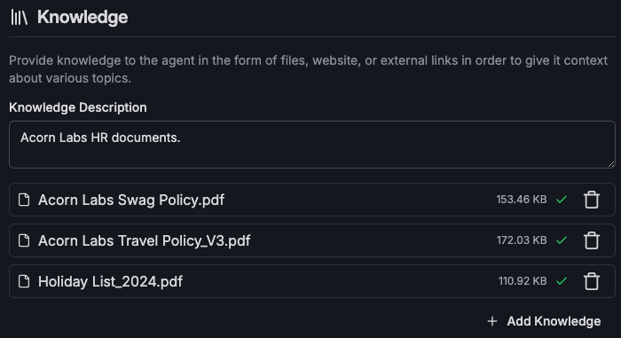
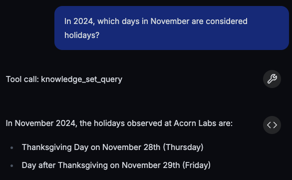

# Tutorial: Create a Knowledge Agent

Otto8 makes it easy to create an agent to answer questions about a set of documents, using its built-in RAG feature.
This tutorial will demonstrate how to do this.

:::note
As you configure the agent, changes will be saved and applied automatically.
:::

## 1. Setting up the agent

Start by going to the Agents page in the admin UI and clicking **+ New Agent**.
Set the agent name and description to whatever you would like

Next, write some instructions for the agent.
This is a prompt that explains what you would like it to do for you.
Tell it about the documents that you will give to it, and what it should do with them.
Here is an example:

## 2. Adding documents

Scroll down to the **Knowledge** section.
Fill in the **Knowledge Description** box with information about the documents that you will provide.
Then, click on the **+ Add Knowledge** button.
You can then upload files directly from your computer, sync with Notion or OneDrive, or scrape a website.
The example below uses some HR policies from Acorn Labs.

## 3. Testing the agent

You can now begin chatting with the agent in the chat interface to the right.
Start by asking it a simple question that can be answered by at least one of the documents you provided.

## 4. Publishing the agent (optional)

If you're happy with the agent and want other users on your Otto8 instance to be able to use it,
you can click the **Publish** button on the agent configuration page.
This will make it available in the user UI for all users to chat with.
