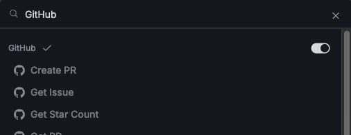
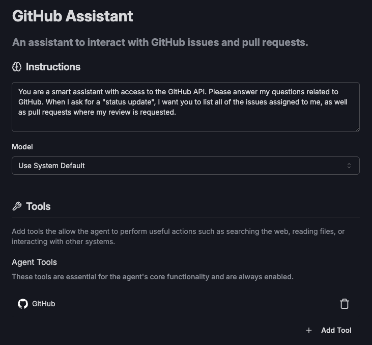
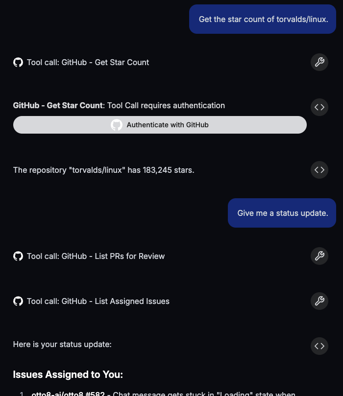

# Create a Personal GitHub Task Agent

This is a short tutorial demonstrating how to create an Otto8 agent that interacts with GitHub. The agent will help you keep track of the work assigned to you in GitHub.

:::note
As you configure the agent, changes will be saved and applied automatically.
:::

## 1. Setting up the agent

Start by going to the Agents page in the admin UI and clicking **+ New Agent**.
Set the agent name and description to whatever you would like.

Next, write some instructions for the agent.
This is a prompt that explains what you would like it to do for you.
Here is one example you can try:

```text
You are a smart assistant with access to the GitHub API.
Please answer my questions related to GitHub.
When I ask for a "status update", list all of the issues assigned to me, as well as pull requests where my review is requested.
```

## 2. Adding the tools

Now we need to give the agent access to the GitHub tools.
Click on the **+ Add Tool** button and search for `GitHub`.
You should see a whole category of tools for GitHub.
Click on the toggle button at the right side of the category name to add all the GitHub tools to the agent.



When you are finished configuring the agent, it should look something like this:



## 3. Testing the agent

You can now begin chatting with the agent in the chat interface to the right.
Start by asking it to do something simple, like getting the star count of the repo "torvalds/linux".
When it makes its first tool call, you will have to sign in to GitHub to authorize the agent to access your account.
Then, try having it interact with things specific to your account.
If you gave your agent instructions about a "status update", ask for one and see what it does.



## 4. Publishing the agent (optional)

If you're happy with the agent and want other users on your Otto8 instance to be able to use it,
you can click the **Publish** button on the agent configuration page.
This will make it available in the user UI for all users to chat with.
Each user will have to sign in to GitHub on their own when prompted to do so by the agent.
